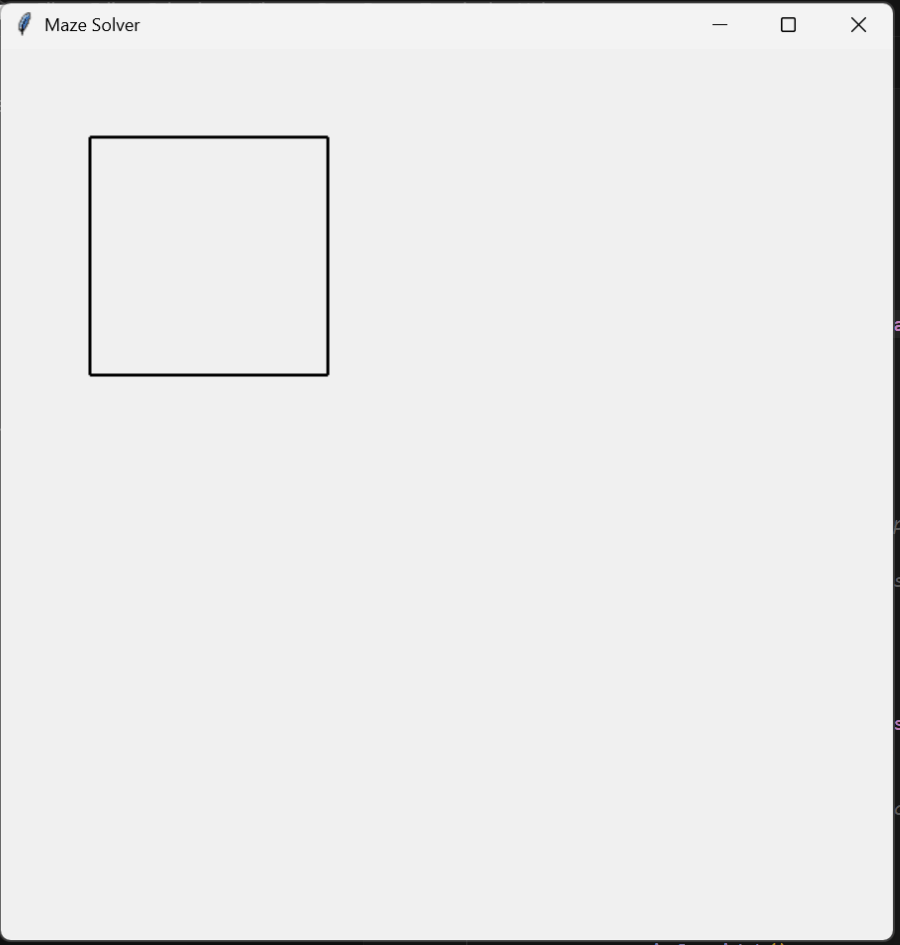
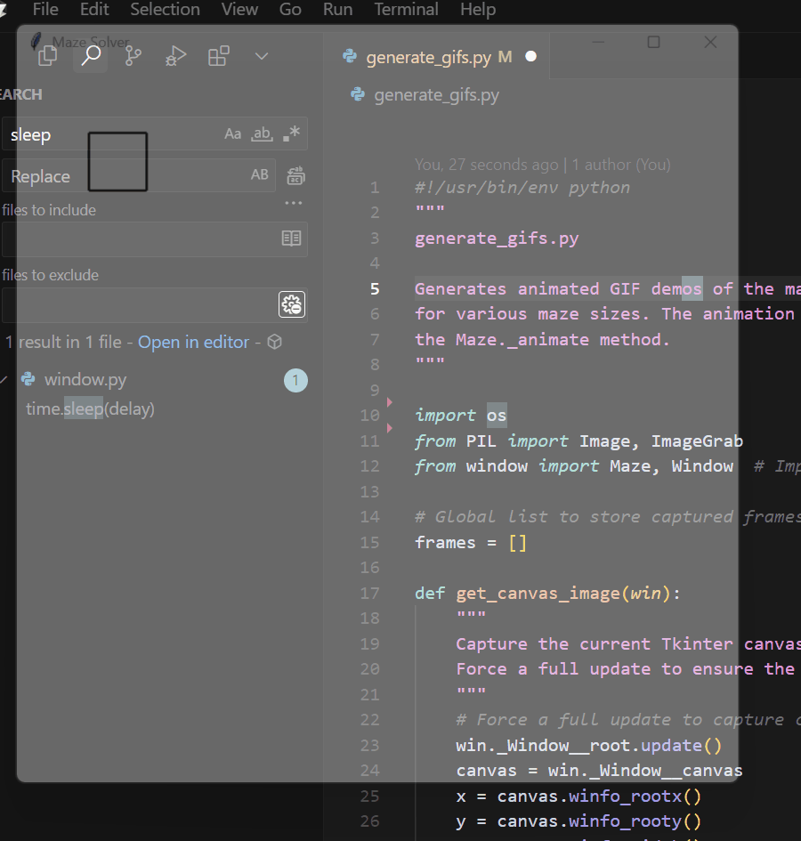

# Maze Solver

A simple maze generator and solver using Python's Tkinter.

## Overview

This project visually generates and solves mazes. The demo GIFs below show various maze sizes being built, solved, and then paused so you can appreciate the result.

## Demo GIFs

- **Small Maze (3x3):**

  

- **Medium Maze (4x6):**

  

- **Large Maze (10x10):**

  

## How To Use

1. Install the required packages:
   ```
   pip install pillow
   ```
2. Run the maze generator and solver:
   ```
   python window.py
   ```
   This will run a maze, but not save it.
3. (Optional). Run the gif generator:
   ```
   python generate_gifs.py
   ```
   This will save the demo GIFs into a `gifs/` folder.
   
Enjoy exploring the maze visuals! 